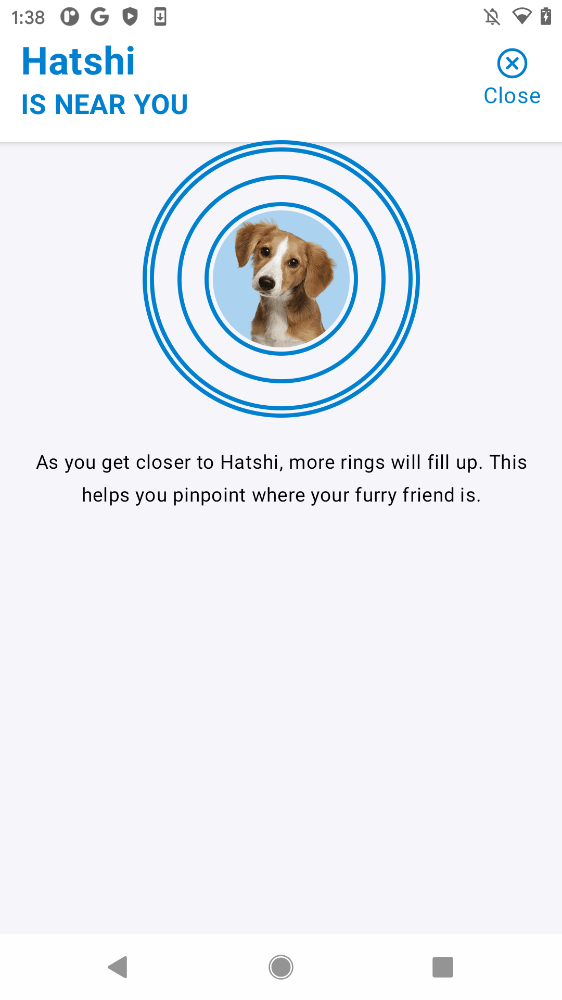
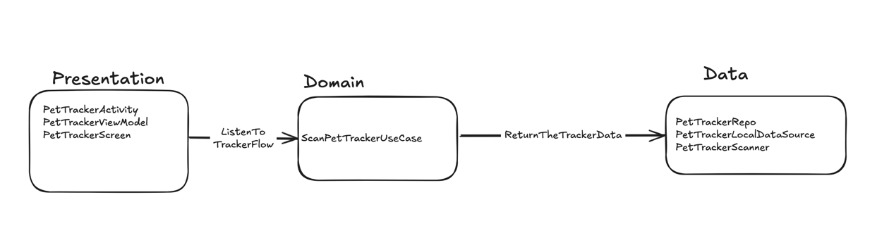
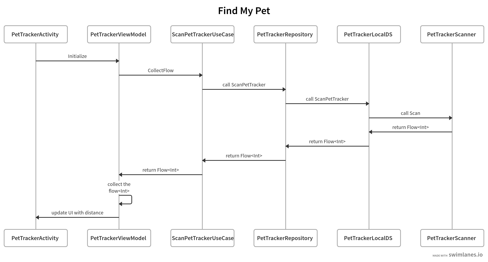

# Find My Pet 

## Overview

This project demonstrates the implementation of tracking the Pets bluetooth devices by showing animated circles using Jetpack Compose to tell the user if he is near to his pet or not.

## Architecture

The architecture of this project is based on clean architecture principles which promotes separation of concerns by separate the app in different layers,
each layer use different design patterns such as the Model-View-ViewModel (MVVM) pattern in the presentation layer, Repository Pattern in data layer,
and Service Locator pattern to provide dependencies to each layer, making the application more maintainable and testable.

### Components

- **Data**: Represents the data layer which responsible for scanning the Pets trackers and return `flow<Int>` that tells the distance between the device and the pet tracker.

- **Domain**: The layer where communicate between the presentation layer and data layer. 

- **Presentation**: Which consists of the View Model class that listen for the distance flow from the use case,
and The UI layer implemented with Jetpack Compose. It consists of composables that render the animated circles that indicate if the pet is near to the user or not.

### Flow of Data

1. The user interacts with the UI, triggering events by just opening the app.
2. The ViewModel processes these events, Listen to the flow of distance that come form the scanners that comes from the use case.
3. The Use case communicate with data layer to return the flow of scanned bluetooth device and return flow of the distance
4. The data layer scan for bluetooth device and return the distance as the scanner keep scanning it emits the flow (Currently it is just return random numbers between 0 and 30)

## Questions & Answers

- Which specialists/teams should be involved in the whole development process?
  - The Business team who will check the requirements depending on the customer needs,
  - The UI team which will design the UX flow for the users and UI icon and colors
  - The Testing team who will put the test strategies and different scenarios
  - The Development team which consists of Backend (for any features needed like save the bluetooth device config),
  - The Firmware team who will develop the tracker of the pet
  - The DevOps team who responsible to setup the deployment environment
  The mobile team who will develop the feature on mobile on different platforms
- Do you expect involvement of other dev teams (besides mobile)?
  - Yes, If we need to scan for Pet tracking using the GPS locations from the Pet tracker which being sent to the server, 
    we will need to implement socket connection between mobile and backend to check if user near to tracker or not,
    also we may need to save some bluetooth device config with user profile. Another team which will be the testing team to test the feature with different scenarios
- How would you setup the deployment to the play store?
  - First create proguard rules file to keep the needed files from being obfuscated during the creation of production APK
  - Setup Automated CI/CD like GitHub Actions to automate builds, run test and prepare APKs
  - Setup staged rollout and use play console metrics to monitor crash reports, app statistics and user feedback
  - App Signing with strong passwords
  - Integrate some analytics tools such as Firebase for user engagements
